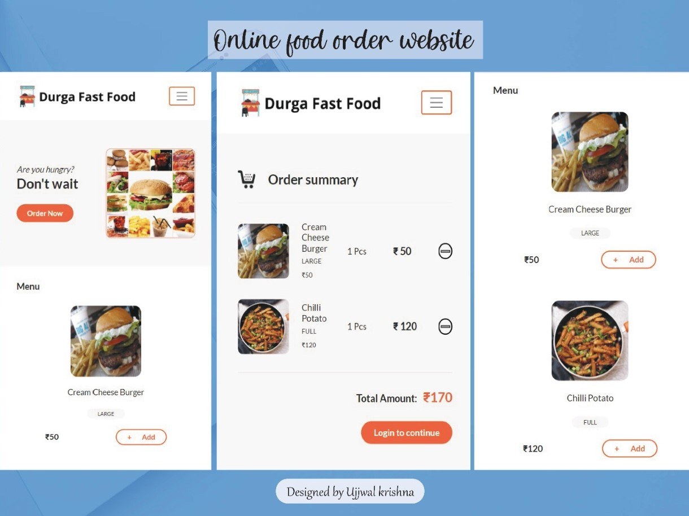

<div align="center">

  


</div>

---

<p align="center">Online Fast food ordering website where customer can order fast food online.</p>

# Table of Contents
+ [Features](#description)
+ [Getting Started](#getting_started)
+ [Built With](#built_with)
+ [Contact](#contact)

## Features <a name="description"></a>
+ User can add items to cart and book order.
+ They can get realtime update of the current status of fast food delivery.

## Getting Started <a name="getting_started"></a>
These instructions will get you a copy of the project up and running on your local machine for development and testing purposes. See deployment for notes on how to deploy the project on a live system.

### Installing
A step by step series of examples that tell you how to get a development env running

Cloning the repo
```
$ git clone https://github.com/ujjwalkrishna/fast-food-website.git
```
Installing the dependencies
```
$ cd online-fast-food
$ npm install
```
Running the server
```
$ node server.js
```

## Built With <a name="built_with"></a>

Website:
+ HTML - Markup language for creating web pages
+ CSS - Style Sheet Language
+ EJS - Scripting Language for web pages
+ Bootstrap - Templating
+ Nodejs - Handle client requests
+ Socket.io - For realtime updates

<!-- CONTACT -->
## Contact <a name="contact"></a>

Krishna Ujjwal - [@linkedin_ujjwalkrishn48](https://www.linkedin.com/in/ujjwalkrishna48/) - ujjwalkrishna48@gmail.com

Project Link: [https://github.com/ujjwalkrishna/ProductFi.git](https://github.com/ujjwalkrishna/fast-food-website.git)

